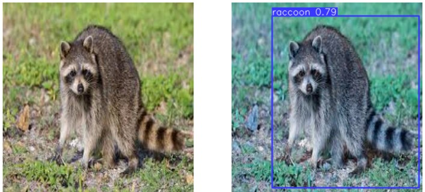

# detection
**решение задачи декетции с помощью дообучения модели YOLO**

**data**:
dataset: https://public.roboflow.com/object-detection/raccoon
общее кол-во фото:200

почти на всех картинках 1 детектируемый объект, данные рапсределены равномерно

мало данных, большая вероятность переобучения

**model**:
YOLOv8-двустадийная нейросеть, структура: backbone-neck-head

**используемые методы**: 
transfer-learning (дообучение с помощью заморзки начальных 15 слоев YOLO)
aргументация данных (для борьбы с переобучением)

**метрики**:
основная метрика: mean average presision (насколько хорошо найдены объекты,т е пересечение найденного с раельным)
1) map50: 0.919 (пересчение предсказанного с реальным больше половины)
2) map50-95: 0.57
3) precision: 0.94 (точность)
4) recall: 0.85 (полнота)

**примеры**:

**code**:
1) notebooks/analys.ipynb - анализ данных 
2) notebooks/train.ipynb - обучение и оценка

**best model**:
detection/frozen/last.pt

