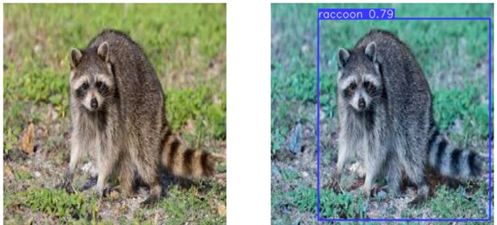

# detection

**решение задачи детекции с помощью дообучения модели YOLO**

## data
dataset: https://public.roboflow.com/object-detection/raccoon  
общее кол-во фото: 200

- почти на всех картинках 1 детектируемый объект
- данные распределены равномерно
- мало данных

### EDA
| Показатель | Значение |
|------------|----------|
| Всего bbox | 213 |
| Средний размер bbox | 254×318 px |
| Средняя площадь относительно изображения | 48.8% |
| Large objects (>96×96) | 96.7% |
| Medium objects (32×32 – 96×96) | 3.3% |
| Small objects (<32×32) | 0% |

**Вывод:** почти все еноты крупные, занимают ~50% кадра.

## model
**YOLOv8s** — двустадийная нейросеть, структура: backbone → neck → head

## используемые методы

### transfer learning
- Базовая модель предобучена на COCO
- Заморожены: backbone + 5 первых слоев neck 
- Обучаются: оставшаяся часть neck + head

### аугментация данных
| Параметр | Значение |
|----------|----------|
| HSV_H | 0.02 |
| HSV_S | 0.7 |
| HSV_V | 0.4 |
| degrees (поворот) | 15° |
| fliplr (отражение) | 0.5 |
| translate (сдвиг) | 0.1 |
| scale (масштаб) | 0.3 |

### параметры обучения
| Параметр | Значение |
|----------|----------|
| Эпохи | 50 |
| Imgsz | 416×416 |
| Batch size | 8 |
| Optimizer | Adam |
| Learning rate | 0.001 |
| Weight decay (L2) | 0.0005 |
| Early stopping patience | 30 |

## результаты

### динамика обучения
- mAP50 стабилизируется к середине обучения, максимум на 28-й эпохе
- train и val loss падают синхронно

### итоговые метрики на тесте
| Метрика | Значение |
|---------|----------|
| mAP50 | **0.919** |
| mAP50-95 | 0.571 |
| Precision | 0.941 |
| Recall | 0.850 |

### сравнение: до и после дообучения
| Модель | mAP50 | Precision | Recall |
|--------|-------|-----------|--------|
| YOLOv8s (без дообучения) | 0.845 | 0.941 | 0.85 |
| **YOLOv8s (дообученная)** | **0.919** | 0.941 | 0.85 |

**улучшение:** +0.074 mAP50 (+8.8%)

## примеры

## выводы
1. Transfer learning + заморозка слоёв эффективны даже на малом датасете (200 фото)
2. Аугментация помогла избежать переобучения
3. Дообучение улучшило mAP50 на 8.8% по сравнению с базовой YOLO
4. Ограничение: модель может быть слабее на маленьких объектах 

## code
- `notebooks/analys.ipynb` — анализ данных (распределение bbox, размеров объектов)
- `notebooks/train.ipynb` — обучение и оценка

## best model
`detection/frozen/last.pt`
